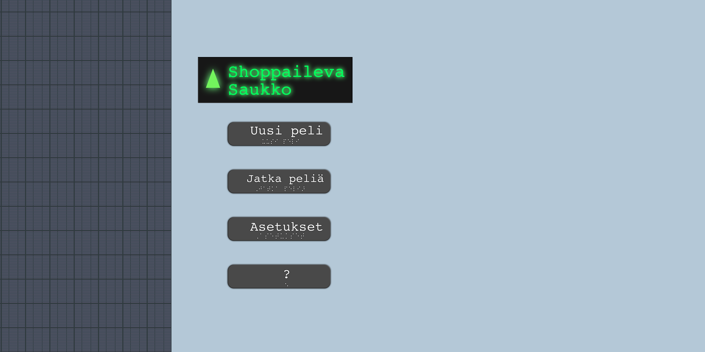

# Shoppaileva Saukko



**Shoppaileva Saukko** (In english: *Shopper Otter*) is a tile-based shopping
adventure built with Python and [Kivy](https://kivy.org/). It is a Kivy rewrite
of an earlier Pygame project.

Explore a procedurally assembled department store, search the shelves for the
items on your shopping list, and make it back to the lift before the floor
closes. Before starting, you choose one character-strength card from each of
six categories. The cards provide abilities intended to help with obstacles,
navigation, and other shoppers.

> [!NOTE]
> This repository is an in-development game prototype. The core exploration,
> item collection, floor generation, and card-selection flow are present, but
> several screens and strength-card effects are still being ported.

## Gameplay

Each run begins by selecting six strength cards—one from each category:

- Wisdom and knowledge
- Courage
- Humanity
- Justice
- Temperance
- Spirituality

You can choose the cards individually or randomize the complete set. In the
store, rooms are selected from CSV layouts and generated as you explore. Items
become rarer farther away from the starting room, encouraging you to venture
deeper into the floor.

The shopping list contains five randomly selected products with different
required quantities and rarities. Walk onto an item and pick it up to find out whether it
belongs on your list. Return to a lift to finish the current floor and continue
to the next one.

## Controls

| Action | Control |
| --- | --- |
| Move | `W`, `A`, `S`, `D` |
| Choose a card or card pile | Click or tap it |
| Use a selected strength | Click or tap **Activate card** |
| Collect an item | Stand on it, then click or tap **Pick up item** |
| Leave the floor | Stand on the lift, then click or tap **To the lift** |

The interface is designed to support both mouse and touch input. The finished product is meant to support touchscreen/mobile.

## Getting started

### Requirements

- Python 3.9 or newer
- Kivy 2.3.x

Kivy publishes platform-specific installation notes in its
[official installation guide](https://kivy.org/doc/stable/gettingstarted/installation.html).

### Run locally

Clone the repository, open a terminal in its root directory, and create a
virtual environment:

```bash
python3 -m venv .venv
source .venv/bin/activate
python -m pip install --upgrade pip
python -m pip install -e .
python main.py
```

On Windows PowerShell, activate the environment with:

```powershell
.\.venv\Scripts\Activate.ps1
```

Run the game from the repository root because its images, fonts, translations,
and room layouts are loaded using relative paths.

Run the dependency-free content and source checks with:

```bash
python3 -m unittest discover -s tests -v
```

## Current development status

The current Kivy version includes:

- Main menu, strength selection, and gameplay screens
- Manual or randomized selection of six cards from 26 strengths
- A generated `9 × 9` floor made from predefined room layouts
- Animated movement, collision detection, and room-to-room travel
- Distance-based item rarity and shopping-list progress
- Five-minute floor timers and lift-based floor transitions
- Initial playable card effects: Curiosity, Zest, Humility, Appreciation, and Gratitude
- Responsive scaling from a `4000 × 2000` design canvas

Still in progress:

- Save/continue functionality
- Settings and game-information screens
- End-of-run success and timeout handling
- Most NPC, cart, water, darkness, and advertisement interactions
- Several strength-card effects that still reference systems from the earlier Pygame implementation
- Complete localization: Finnish is the only populated language; English is partial and Swedish is currently empty
- Automated gameplay tests and packaged releases
- Possible additions include also: tutorial level, achievements

The application currently starts in Finnish. Change `lang = "fi"` in
`main.py` to select another translation while localization work continues.

## Project structure

| Path | Purpose |
| --- | --- |
| `main.py` | Application entry point, screen management, and locale loading |
| `localization.py` | Shared bridge to the running app's translations |
| `shopper.kv` | Kivy interface definitions and screen layouts |
| `game.py` | Main game loop, floor generation, room travel, and interactions |
| `playerClass.py`, `playerEffects.py` | Player movement, collision, and temporary effects |
| `room.py`, `tile.py`, `navigationStone.py` | Room construction and room-local objects |
| `roomLayout.py` | Room CSV loading and layout separation |
| `shoppingList.py`, `item.py` | Shopping-list progress, item rarity, and item animation |
| `strengthMenu.py` | Pre-game strength-card selection |
| `strengthDeck.py`, `strengthCard.py`, `cardLogic.py` | Card behavior and shared card rules |
| `const.py` | Gameplay tuning values, item pools, and loaded room layouts |
| `rooms/` | CSV room-layout data |
| `i18n/` | JSON translation files |
| `images/` | Sprites, cards, interface art, and sprite sheets |
| `fonts/` | Bundled Courier Prime font files and their license |
| `AGENTS.md` | Working rules and verification requirements for Codex |
| `ROADMAP.md` | Ordered milestones with acceptance criteria |
| `docs/` | Architecture, game-design, porting, content, testing, and decision records |
| `tests/` | Headless source and content-contract checks |
| `pyproject.toml` | Python/Kivy dependency and project metadata |

Room layouts use numeric tile codes. The complete current mapping is documented
in [`docs/CONTENT_FORMATS.md`](docs/CONTENT_FORMATS.md); for example, `0` is a
wall, `1` is a floor, `2` is a shelf, `3` is a lift, `4` is a crate, and `7` is
water.

## Tuning and adding content

Most gameplay values—including movement speed, floor duration, item spawn
chance, rarity curves, and floor size—are collected in `const.py`.

To add or edit rooms, update the CSV files in `rooms/`. Multiple layouts can
live in one file and are separated by an empty row. Standard rooms are
`15 × 15` tiles.

Translations use dot-separated keys in `i18n/*.json`. When adding a new
language, create its JSON file and use the filename (without `.json`) as the
application language code.

## Development documentation

Before making a gameplay change, read [`AGENTS.md`](AGENTS.md) and the relevant
document under [`docs/`](docs/):

- [`ARCHITECTURE.md`](docs/ARCHITECTURE.md) describes current Kivy ownership and
  runtime flow.
- [`GAME_DESIGN.md`](docs/GAME_DESIGN.md) separates confirmed behavior, legacy
  intent, and open product decisions.
- [`PORTING_STATUS.md`](docs/PORTING_STATUS.md) tracks the Kivy status of core
  systems and all 26 strength cards.
- [`CONTENT_FORMATS.md`](docs/CONTENT_FORMATS.md) defines room, translation,
  card, item, and sprite-sheet contracts.
- [`TESTING.md`](docs/TESTING.md) contains automated and manual verification.

The earlier Pygame implementation is available at
[`Llaugo/VahvuusVaris`](https://github.com/Llaugo/VahvuusVaris). It is useful as
a behavior and design reference, but the Kivy code and accepted decision records
are authoritative for the current runtime.

## Credits and licensing

The code is written and all images and textures have been created by Lauri. 
The concept and the game design has been worked on by both Lauri and Heidi.

The bundled Courier Prime font is distributed under the SIL Open Font License;
see [`fonts/Courier_Prime/OFL.txt`](fonts/Courier_Prime/OFL.txt).
