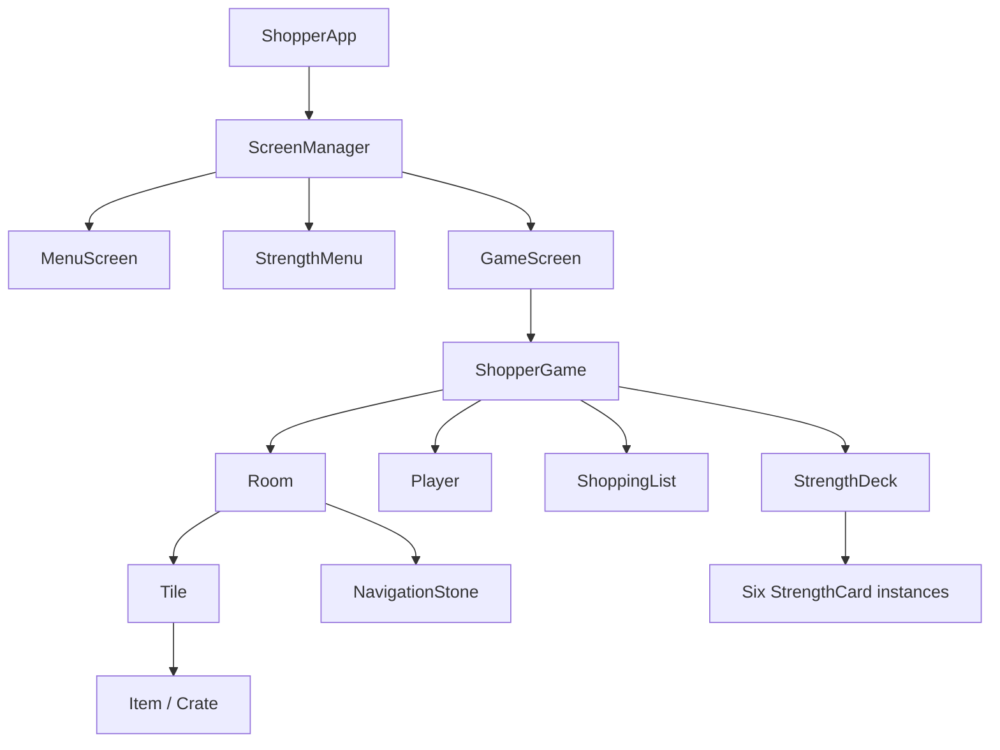

# Architecture

This document describes the current Kivy implementation. It is descriptive, not
a promise that every present behavior is intended. Known gaps are listed in
`PORTING_STATUS.md`; intended rules are in `GAME_DESIGN.md`.

## Runtime shape



`ShopperApp` in `main.py` creates the screens. Kivy automatically loads
`shopper.kv` for the `ShopperApp` class; the KV rules instantiate the widget
tree beneath each screen.

When `GameScreen` is entered, it binds keyboard handlers and schedules
`ShopperGame.update` at 60 calls per second. `update(dt)` passes real elapsed
seconds to the player, current room, shopping list, and strength deck.

## Ownership map

| Area | Owner | Collaborators |
| --- | --- | --- |
| App and current locale | `main.ShopperApp` | `localization.tr`, KV labels |
| Screen lifecycle | `main.GameScreen` and `ScreenManager` | `shopper.kv` |
| Run and floor state | `game.ShopperGame` | room, player, list, deck |
| Player input/effects/collision | `playerClass.Player` | `playerEffects.TimedSpeedEffects`, `ShopperGame.pressed`, `Room` |
| Room decoding and local collections | `room.Room` | `Tile`, `Item`, `Crate`, `NavigationStone` |
| Tile rendering and item spawning | `tile.Tile` | `SpriteSheet`, `Item` |
| Shopping goal and feedback | `shoppingList.ShoppingList` | `const.shop`, translations |
| Card selection before a run | `strengthMenu.StrengthMenu` | card images, translations |
| Card selection during a run | `strengthDeck.StrengthDeck` | six card instances, player range |
| Individual card behavior | subclasses in `strengthCard.py` | `cardLogic`, game/player/room APIs |
| Tuning and content indexes | `const.py` | `roomLayout.readLayouts` |
| Presentation and widget composition | `shopper.kv` | Kivy properties and `ids` |

Small reusable code is grouped by domain instead of being collected in a
generic utility module. Pure card rules live in `cardLogic.py`, item placement
rules in `itemLogic.py`, temporary player-effect state in `playerEffects.py`,
room-file parsing in `roomLayout.py`, and the Kivy translation bridge in
`localization.py`. Single-owner helpers stay private to their owning module.

## Startup and screen lifecycle

1. `main.py` registers Courier Prime under Kivy's default `Roboto` family.
2. `ShopperApp.build` loads the selected JSON locale and creates five screens:
   menu, strengths, settings, question/info, and game.
3. `StrengthMenu.on_kv_post` creates six category arrays over stable card IDs
   `0..25`.
4. Starting a game converts per-category selection indexes to global card IDs,
   calls `ShopperGame.setStrengthCards`, then switches to the game screen.
5. `GameScreen.on_enter` binds input and schedules the update loop;
   `on_leave` is intended to undo both actions.

Current caveat: `ShopperGame.__init__` also binds the same keyboard events. This
duplicates lifecycle ownership and is scheduled for audit in Roadmap milestone
1. New code must not add another binding site.

## Game initialization

`ShopperGame.on_kv_post` performs widget-dependent initialization:

- captures the initial room and player from KV IDs;
- installs scaling based on a 4000 x 2000 design canvas;
- resizes the player hitbox;
- calls `resetFloor`;
- captures the shopping list and strength deck widgets.

`resetFloor` creates a `floorSize x floorSize` matrix of optional `Room`
instances and stores the current position in the middle. Rooms are created
lazily as the player crosses a boundary. At present the starting room is loaded
from `const.testRoom`; production `startLayouts` are loaded but unused.

The room matrix is indexed as `rooms[x][y]`:

- south: `(x, y + 1)`
- east: `(x + 1, y)`
- north: `(x, y - 1)`
- west: `(x - 1, y)`

The external door widget order is `[south, east, north, west]`. Keep string
directions at the `ShopperGame` boundary; the integer direction codes inside
room-layout behavior are a legacy seam and should be replaced or tested before
being extended.

## Room and content construction

`roomLayout.readLayouts` returns a list of integer matrices. A row whose cells
are all empty ends the current matrix. `Room.setRoom` translates raw content
codes to runtime `Tile` frames and records room-local collections such as walls,
shelves, items, crates, water, NPCs, carts, and adverts.

Tiles own optional item and crate widgets. A shelf may create an `Item` during
construction. Appreciation asks the current `Room` to choose an empty shelf;
the room applies the capped rarity-distance bonus and mirrors the new tile item
in its item collection. Gratitude-card navigation stones are direct room
children so they remain attached when an existing room is revisited. `Room`
mirrors these child objects in lists used by update, collision, and interaction
code. Whenever a child is added or removed, both the widget tree and the
corresponding room collection must remain synchronized.

See `CONTENT_FORMATS.md` for the raw-code contract and currently dormant marker
types.

## Update loop and state transitions

The active update path is:

```text
ShopperGame.update(dt)
  Player.update(dt, game)
  Room.update(dt, player)
  ShoppingList.update(dt)        only while gameActive
  StrengthDeck.update(dt, game)  only while gameActive
  interaction button visibility
  room-exit collision
  floor timer decrement          only while gameActive
```

A room transition removes the old `Room` widget, attaches the target room,
moves the player to the opposite edge, and schedules recentering after Kivy has
updated layout. A floor escape swaps to a special 5 x 5 lift room and resets
the strength deck. `nextFloor` increments the floor number, regenerates the
matrix, and resets the deck again.

Player speed effects are keyed by their source and count down independently.
The strongest active speed wins, which prevents a Gratitude stone from
downgrading Zest while allowing the remaining Gratitude boost to resume after
Zest expires.

Temporary effects must define behavior for four boundaries:

1. natural expiry;
2. explicit card/deck reset;
3. room transition;
4. floor or screen transition.

## Time model

All active Kivy timers use seconds and are decremented by `dt`. This differs
from the legacy Pygame loop, which decremented counters by one per frame at a
nominal 60 FPS. Accepted Decision Record 0002 defines the conversion rule.

Avoid equality checks such as `timer == 1` for expiry. `dt` is a float and may
cross any exact value. Capture the old value, update, and detect the transition
from positive to zero.

## UI boundary

Python reaches KV children through `ids` such as `game`, `room`, `player`,
`shoplist`, `strengthDeck`, `itemButton`, and `liftButton`. Treat these names as
public interface members. If an ID moves between KV rules, verify the Python
owner can still access it at the same lifecycle point.

Use Kivy properties when KV reads a value. Ordinary Python attributes are fine
for internal collections and state that does not need binding.

## Localization flow

`ShopperApp.setLanguage` reads `i18n/<language>.json` into a flat dictionary.
`app.tr`, `StrengthMenu.tr`, and `localization.tr` return the key itself when a
value is missing. Finnish is the source locale. English uses an older,
incompatible key set and Swedish is an empty placeholder; neither is currently
selectable as a complete experience.

## Architectural risks to address before expansion

- Live and legacy player implementations share one source file, even though the
  latter is inside a string literal.
- Most card classes still reference missing Pygame-era floor/player APIs.
- Timer values and exact-value expiry checks are only partly converted.
- Cart, NPC, advert, darkness, and water state are not yet converted from the pygame-era.
- `ShopperGame` and `GameScreen` both bind keyboard events.
- Production start layouts are bypassed by a test layout.
- The UI contains destinations that do not have a working screen or flow.
- Game-over and completed-list state are not connected to screen transitions.
