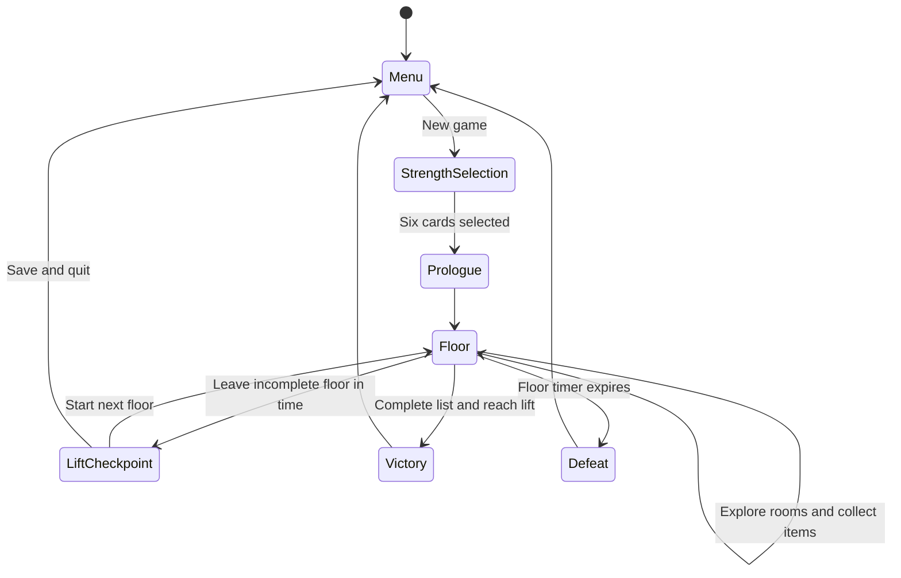

# Game design contract

This document separates confirmed Kivy behavior from historical intent and open
product decisions. It exists so implementation work does not invent game rules
from incomplete code.

Labels used below:

- **Current**: observable in the Kivy project.
- **Intended**: stated in the project README or clearly represented by both the
  Kivy and legacy projects.
- **Legacy reference**: behavior in the Pygame project that has not yet been
  confirmed for the Kivy version.
- **Open**: requires a product decision before implementation.

The legacy reference is <https://github.com/Llaugo/VahvuusVaris>.

## Player experience

**Intended:** The player is an otter exploring procedurally assembled department
store floors under time pressure. The player searches shelves for products on a
shopping list, uses character-strength cards to overcome obstacles, and returns
to a lift between floors.

The tone should remain friendly, readable, and suitable for touch/mobile play.
Obstacles create navigation and decision pressure; strengths provide positive,
character-themed ways to respond rather than combat.

## Run loop

The prologue, victory, defeat, save, and continue portions are legacy reference;
the current Kivy build goes directly from strength selection to gameplay and
uses the lift room only between floors.

## Shopping objective

**Current and intended:** A shopping list contains five products, one from each
rarity tier. Required quantities are:

| Rarity | Relative availability | Required quantity |
| --- | --- | ---: |
| 5 | Rarest | 1 |
| 4 | Very rare | 2 |
| 3 | Uncommon | 4 |
| 2 | Common | 6 |
| 1 | Most common | 10 |

Each tier contains five possible product names. Picking up an item reveals its
name. Needed items increment the matching count up to its requirement; other
items provide feedback but do not change progress.

**Current and intended:** Item rarity depends on Manhattan room distance from
the floor's central starting room. More distant rooms have a higher probability
of rare items. The cumulative distributions live in `const.itemRarity`.

**Intended:** Completing the entire shopping list enables the successful end of
the run. The legacy project declares victory when the completed player reaches
a lift.

## Floors and rooms

**Current:** A floor is a 9 x 9 matrix of lazily generated rooms. The player
starts in the center. Standard rooms are chosen independently from predefined
15 x 15 CSV layouts when first visited and remain in memory for that floor.

**Intended:** Production floors start from one of the dedicated start layouts.
The current Kivy project temporarily uses `testRoom.csv` instead.

**Current:** Moving through the south/east/north/west room boundary moves to the
adjacent matrix position. Boundary exits leading beyond the 9 x 9 matrix are
closed.

**Legacy reference:** The first playable floor is numbered 1. The Kivy build
currently begins at floor 0 and increments after the first lift transition.

## Time, lift, victory, and defeat

**Current and intended:** A floor begins with 300 seconds. Timers in the Kivy
runtime are real seconds.

**Intended:** Failing to leave the floor before time expires ends the run. This
happens even if the player is standing on the lift when the timer reaches zero.
Completing the list and then returning to a lift wins the run. Neither transition is
currently connected in Kivy. 

**Legacy reference:** A player with an incomplete list could leave a floor after
at least three seconds had elapsed (`floorTimeMin = 297`). Reaching the lift
earlier showed a countdown. This lift opening timer will be increased, but the
smaller cooldown is easier to work with while testing.

## Strength selection and progression

**Current and intended:** Before a run, choose one card from each category:

| Category | Card IDs |
| --- | --- |
| Wisdom and knowledge | 0-4 |
| Courage | 5-9 |
| Humanity | 10-13 |
| Justice | 14-16 |
| Temperance | 17-20 |
| Spirituality | 21-25 |

The selection may be manual or randomized. Card IDs are stable content IDs and
must not be reordered.

**Current and intended:** Activating a card starts its effect and cooldown. Card
use grants experience up to level 3; crossing a whole level improves
card-specific duration, cooldown, range, or effect strength. The idea is that
using a strength often improves that strength, similarly to real life.

**Intended:** Only one card is selected for activation at a time. Failed
contextual actions should give feedback and should not consume the activation
or cooldown unless that card explicitly defines a cost for failure.

**Legacy reference:** Prudence pauses the world and lets other cards' cooldowns
continue, with an extra cooldown benefit at level 3. This needs a Kivy-safe
definition before porting because floor time, movement, room animation, and
card time can be paused independently.

Every card implementation must specify:

- valid target/context;
- success and failure result;
- duration and cooldown in seconds;
- leveling change at levels 2 and 3;
- natural expiry behavior;
- reset behavior at room, floor, and screen boundaries;
- interaction with other simultaneous effects.

Active card overlays use frames 5-8 at eight frames per second, looping twice
per second regardless of effect duration. Cooldown frames 9-24 remain tied to
cooldown progress. Cards may explicitly opt out of the active loop when their
timer represents a repeatedly refreshed secondary effect, as Gratitude does.

See `PORTING_STATUS.md` for the per-card inventory.

### Appreciation card (ID 21)

**Current and intended:** Activating Appreciation in an active floor room adds
one normal collectible item to a randomly selected empty shelf in that room.
The item is not guaranteed to be on the shopping list. It uses the normal item
rarity distribution at the room's Manhattan distance plus the card's whole
level, capped at the best existing distribution.

If every shelf is occupied, or the room contains no shelves, activation fails
without consuming cooldown, experience, or the card selection. A successful
activation grants normal card experience and is instantaneous; it has no
temporary effect to expire or reset. The new item persists when its room is
revisited during the same floor and is discarded with the floor like the
room's initially generated items.

| Card level | Item rarity-distance bonus | Cooldown |
| ---: | ---: | ---: |
| 1 | +1 | 30 seconds |
| 2 | +2 | 27 seconds |
| 3 | +3 | 24 seconds |

The successful use that reaches level 2 or 3 immediately receives the
three-second cooldown reduction. Its item was generated at the level the card
had when that activation began; the stronger rarity bonus applies from the next
successful activation.

### Gratitude card (ID 22)

**Current and intended:** Activating Gratitude in an active floor room drops one
non-solid navigation stone at the player's position. Dropping a stone while the
player already overlaps another stone fails without consuming cooldown or
experience. Each successful placement grants the normal card experience and
starts the placement cooldown.

Stones belong to the room in which they were placed. They remain visible when
the room is revisited during the same floor and are discarded with the floor.
Their trigger bounds match their visible image bounds.

Touching a stone while Gratitude is in the active deck refreshes a 30 percent
speed boost. The boost and placement cooldown count down independently, and an
existing boost may finish across a normal room transition. Floor, deck, and
screen resets clear the boost. Simultaneous speed boosts do not multiply; the
strongest active boost determines player speed.

The stone-triggered boost never displays the card's active overlay animation.
If placement is still cooling down, its cooldown overlay remains visible while
the boost is active; otherwise the card uses its normal or selected overlay.

| Card level | Stone boost | Placement cooldown |
| ---: | ---: | ---: |
| 1 | 1.0 seconds | 30 seconds |
| 2 | 1.5 seconds | 25 seconds |
| 3 | 2.0 seconds | 20 seconds |

## Obstacles and interactions

| System | Intended role | Current Kivy state |
| --- | --- | --- |
| Crates | Block paths; can be destroyed | Playable |
| Water | Block paths; cards can allow walking through or removing | Rendered, behavior not ported |
| Darkness | Restricts visibility; several cards create light | Not ported |
| Adverts | Push the player in front in the direction the advert is facing; can be turned, destroyed, or blocked | Marker renders, behavior not ported |
| Carts | Mobile obstacles with owners and push rules | Markers decode to floor only, behavior not ported |
| NPC shoppers | Move, block, talk, trade, and own carts | Markers decode to floor only, behavior not ported |

The Pygame implementations define useful interaction outcomes but not Kivy
architecture. Port domain state first, then rendering, then player interaction,
then dependent cards.

## Controls and presentation

**Current:** Movement uses `W`, `A`, `S`, and `D`. Card selection, activation,
item collection, lift use, and menu controls support pointer/touch input.

**Intended:** The complete game supports touchscreen/mobile play. Touch movement
is not currently implemented.

**Open:** Choose a touch movement model before building mobile layouts: four
direction buttons, virtual stick, tap-to-move, or another scheme.

The design canvas is 4000 x 2000 and is scaled uniformly into the rendered
background. Gameplay must remain usable when letterboxed and at non-2:1 aspect
ratios.

## Persistence

**Legacy reference:** Saves are allowed at the lift checkpoint and contain the
six-card deck with levels, current floor number, and shopping-list progress.
Starting a new run asks before replacing an existing save.

**Open:** The Kivy save format, compatibility policy, and exact save boundary
have not been chosen. Do not reuse the legacy Pickle format for new saves. A
future decision record should define a versioned data-only schema and platform
save directory.

## Localization

**Current:** Finnish is the only complete locale. Missing keys display the key
itself. English is partial with outdated key names; Swedish is an empty
placeholder.

**Intended:** Player-visible strings come from flat dot-separated translation
keys. Card and item IDs remain language-independent; localized display names
must not become persistence identifiers.
